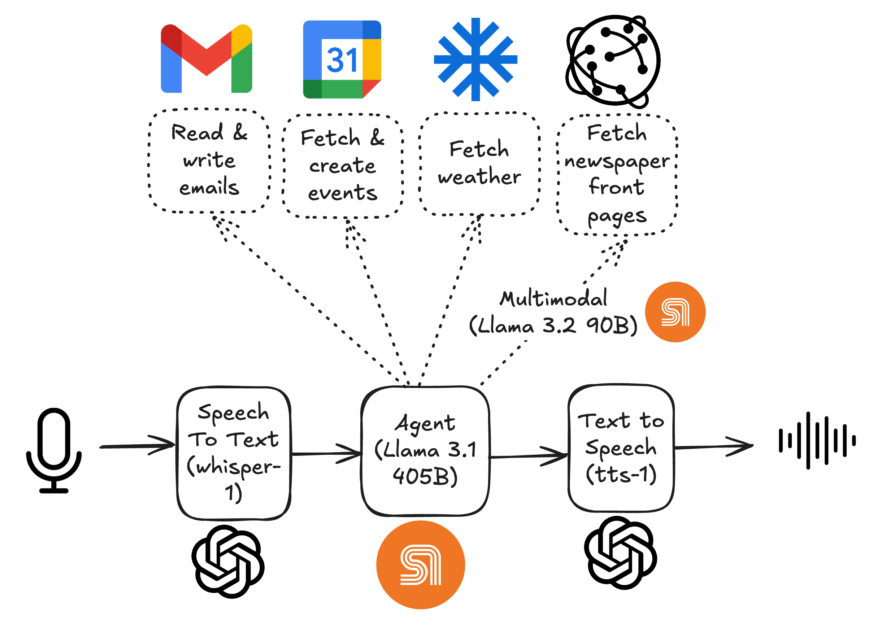

# Your own J.A.R.V.I.S (powered by SambaNova & OpenAI)

https://github.com/user-attachments/assets/9973ea38-7ccc-4577-b483-a4c4b6ab87c1



## Description
Ever dreamed of having your own J.A.R.V.I.S, like Tony Stark in Iron Man? Well, dream no more – it's here! This project brings the futuristic AI assistant experience to life, giving you genuine superpowers for your daily tasks. Imagine having a personal assistant who can manage your emails, track your upcoming events, schedule meetings, check local weather, and even curate and read your daily news – all through natural voice interaction, just like J.A.R.V.I.S. The best part? You don't need to type a single word; everything works seamlessly through voice commands and responses.

At its core, this real-time AI assistant leverages cutting-edge technology through a powerful combination of SambaNova and OpenAI models. The system begins by converting your voice input to text using OpenAI's Whisper-1 model. SambaNova's Llama 3.1 405B then generates contextual responses, utilizing various tools to interact with Gmail, Google Calendar, weather services, and news sources. A unique feature of this assistant is its ability to actually SEE newspaper front pages using Llama 3.2 90B's vision capabilities, providing you with summarized updates of the day's most important stories. All responses are converted back to natural speech using OpenAI's tts-1 model, creating a truly conversational experience. The architecture is designed for easy deployment – simply clone the repository, add your API keys, grant the necessary permissions for Gmail and Calendar, and you're ready to step into the future of personal assistance.

## Repository

| Artifact | Description |
|----------|-------------|
| `app.py` | Main module to interact with the personal assistant agent. |
| `src/chat.py` | Contains functions to control how the agent produces responses. |
| `src/gui.py` | Contains all the code used to generate the GUI for the agent. |
| `src/persistence.py` | Contains functions to save chat history as a JSON file. |
| `src/pydantic_classes.py` | Contains `Metadata` class, used for tracing. |
| `src/settings.py` | Pydantic settings to handle environment variables. |
| `src/tools/` | Contains all the modules that define the agent capabilities. |

## Requirements
The code was developed using Python 3.11. The core Python libraries are:
- Poetry
- OpenAI
- Pydantic
- PyAudio (You may need to install portaudio `brew install portaudio`)
- PyGame
- Google API Python Client

No additional frameworks are required !! Keep it simple!

## How can I use it?
You'll need the following API keys:
- `SAMBA_API_KEY`: [SambaNova API Key](https://sambanova.ai/blog/speed-record-on-llama-3.1-405b)
- `SAMBA_URL`: [SambaNova URL](https://sambanova.ai/blog/speed-record-on-llama-3.1-405b)
- `OPENAI_API_KEY`: [OpenAI API Key](https://openai.com/index/openai-api/)
- `WEATHERSTACK_API_KEY`: [WeatherStack API Key](https://weatherstack.com/)
- `WORLDS_NEWS_API_KEY`: [World News API Key](https://worldnewsapi.com/)

You will need the following env variables:
- `CREDENTIALS_PATH`: OAuth 2.0 Client with access to Gmail API and Calendar API. You can create one in Google Cloud Platform (GCP) and save it as a JSON file named `credentials.json` in the root folder.
- `GMAIL_HOST_USER`: The email of the user authenticated.
- `TIMEZONE`: tzdata, zoneinfo database. For example: `Europe/London`

After obtaining all keys and credentials:

1. Populate the `.env` file:
   This is an example of how it should look:
   ```
   SAMBA_API_KEY=yourapikey
   SAMBA_URL=youurl
   GMAIL_HOST_USER=example@gmail.com
   CREDENTIALS_PATH=credentials.json
   TIMEZONE=Europe/London
   OPENAI_API_KEY=yourapikey
   WEATHERSTACK_API_KEY=yourapikey
   WORLDS_NEWS_API_KEY=yourapikey
   ```

1. Install the environment:
   ```bash
   poetry install
   ```

2. Start chatting with your assistant:
    ```bash
    poetry run python app.py
    ```
